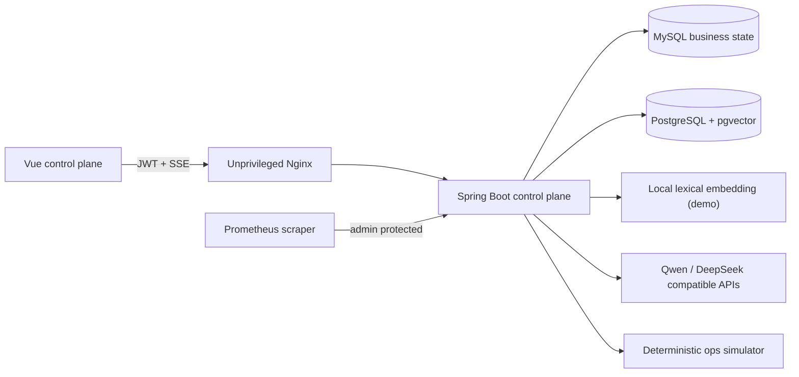
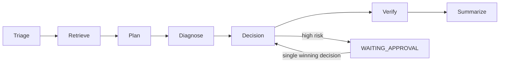

# Architecture

## Runtime topology

宿主机只暴露 Web 端口。数据库和后端只在 Compose 网络内可达，前端反向代理 `/api`、`/actuator` 和长连接 SSE。Compose 默认用本地确定性词法向量器完成离线知识库验收；配置 `KNOWLEDGE_EMBEDDING_PROVIDER=QWEN` 和 DashScope Key 后可切换到 Qwen 语义向量。

## Backend boundaries

- `identity`：认证、JWT、角色和 `TenantContext`。
- `ticket`：工单聚合、状态机和租户范围仓储。
- `knowledge`：文档版本、分块、向量检索和不可变引用。
- `agent`：任务租约、七节点 Graph、预算、事件与恢复点。
- `tool` / `simulator`：Java 白名单、风险策略和确定性故障数据。
- `approval`：带过期时间和原子状态谓词的人工决策。
- `security` / `audit`：不可信内容边界、脱敏和安全审计。
- `evaluation`：30 条基线、MOCK/LIVE 适配器、计分与持久化。
- `observability`：任务、节点、模型、检索、工具和审批指标。

## Agent execution

模型只产生结构化建议。Java 节点控制状态迁移、工具白名单、风险判断、审批和终态；模型文本不能授予权限。每个节点落库后才发布 SSE 事件，客户端使用 `after=<sequence>` 重放。

## Persistence and recovery

MySQL 保存身份、工单、Agent 任务、步骤、模型/工具调用、审批、事件、安全审计和评测结果。pgvector 保存带租户、文档版本和 chunk 索引的知识片段。任务通过租约抢占；恢复服务只从安全 checkpoint 继续，写操作结果不明确时进入 `MANUAL_REQUIRED`。
