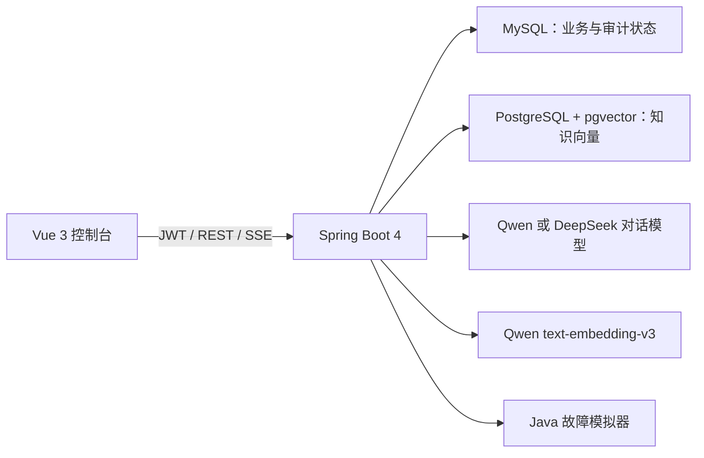
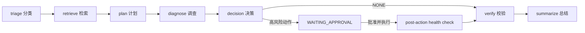

# 完整体验与代码导读

## 1. 这个 Agent 实际解决什么问题

它不是通用聊天机器人，而是一个运维工单诊断与受控处置 Agent。输入是一张带故障场景的工单，输出是可审计的证据、诊断、建议动作和最终结果。

一次任务会完成：

1. 理解工单并判断紧急度、故障类别。
2. 从 pgvector 检索相关 runbook，保留文档、版本、chunk 和引用 ID。
3. 让模型从 Java 白名单中选择只读调查工具。
4. 读取服务健康、指标、日志和依赖，形成诊断证据。
5. 由模型建议 `NONE`、`restartService` 或 `changeConfig`。
6. 高风险写操作必须暂停并等待人工审批。
7. 批准后执行模拟变更，再调用健康检查确认 `RECOVERED`。
8. 将步骤、模型调用、工具调用、审批、事件和 token 用量写入 MySQL。

模型只负责结构化分析和建议，Java 代码掌握权限、状态机、预算、工具执行和最终状态。模型不能给自己增加工具，也不能绕过审批。

## 2. 运行架构



- `identity`：登录、JWT、角色与租户上下文。
- `ticket`：工单、分类、`scenarioKey` 和状态机。
- `knowledge`：文档版本、Markdown 分块、Embedding、pgvector 检索和 citation。
- `agent`：七节点工作流、任务预算、步骤、事件、模型与工具审计。
- `tool` / `simulator`：工具白名单、风险策略和五种确定性故障数据。
- `approval`：单次人工决策、过期、幂等执行和执行后验证。
- `evaluation`：30 条 MOCK/LIVE 基线评测。

入口代码：

- 工作流编排：`server/src/main/java/com/cc/opsagent/agent/application/OpsAgentWorkflow.java`
- Agent 节点：`server/src/main/java/com/cc/opsagent/agent/graph/node/`
- 模型适配：`server/src/main/java/com/cc/opsagent/model/`
- 知识入库：`server/src/main/java/com/cc/opsagent/knowledge/application/DocumentIngestionService.java`
- 向量检索：`server/src/main/java/com/cc/opsagent/knowledge/infrastructure/PgVectorKnowledgeRetriever.java`
- 审批恢复：`server/src/main/java/com/cc/opsagent/approval/application/ApprovalResumeService.java`
- 故障夹具：`server/src/main/resources/scenarios/`

## 3. 七节点工作流



- `triage`、`plan`、`decision` 会调用真实对话模型并要求严格 JSON。
- `retrieve` 使用 Qwen Embedding 查询 pgvector，低于 `KNOWLEDGE_MIN_SCORE` 的 chunk 不返回。
- `diagnose` 只执行计划中且位于 Java allowlist 的只读工具。
- `verify` 不等于盲目执行。写工具先创建审批；批准后还要进行独立健康复查。
- `summarize` 形成最终可展示结果，不保存或展示模型隐藏推理。

## 4. API 配置与启动

真实 Key 只写入被 Git 忽略的 `.env`：

```dotenv
AI_DASHSCOPE_API_KEY=你的百炼Key
DEEPSEEK_API_KEY=你的DeepSeekKey
AGENT_MODEL_PROVIDER=QWEN
KNOWLEDGE_EMBEDDING_PROVIDER=QWEN
KNOWLEDGE_MIN_SCORE=0.25
```

- `AGENT_MODEL_PROVIDER=QWEN`：Agent 使用百炼 `qwen-plus`。
- `AGENT_MODEL_PROVIDER=DEEPSEEK`：Agent 使用 DeepSeek，重建 server 容器后生效。
- `KNOWLEDGE_EMBEDDING_PROVIDER=QWEN`：知识入库和查询均使用 Qwen Embedding。
- DeepSeek 目前只用于对话模型，Embedding 仍由 Qwen 提供。

启动和检查：

```powershell
docker compose --env-file .env up -d --build
docker compose --env-file .env ps
```

浏览器打开 `http://localhost:8088`，使用：

```text
租户：acme
用户：admin
密码：demo-password
```

若修改 `.env` 中的模型供应商，至少重新创建后端：

```powershell
docker compose --env-file .env up -d --force-recreate server
```

## 5. 知识库怎样构建

初始语料清单位于 `deploy/knowledge/initial-runbooks.json`，初始化脚本位于 `scripts/seed-knowledge.ps1`。执行：

```powershell
pwsh -File scripts/seed-knowledge.ps1
```

脚本不是直接写数据库，而是先登录，再逐份调用 `POST /api/knowledge/documents`。后端流程为：

```text
文档校验 → Markdown 分块 → Qwen Embedding → MySQL 文档/版本 → pgvector chunk → 发布
```

脚本可重复执行：它会先检索同名已发布文档，存在时跳过，因此重启 Compose 后不会重复创建语料。

当前五份初始手册分别依据 Redis、HikariCP、Spring Boot、Apache Kafka 和 Kubernetes 官方文档。每份文档都保存 `source`、`sourceType`、`product`、`scenarioKey` 和 `reviewedAt`，正文包含适用现象、证据收集、处置边界及恢复验证。来源：

- Redis latency：<https://redis.io/docs/latest/operate/oss_and_stack/management/optimization/latency/>
- HikariCP：<https://github.com/brettwooldridge/HikariCP>
- Spring Boot metrics：<https://docs.spring.io/spring-boot/reference/actuator/metrics.html>
- Kafka monitoring：<https://kafka.apache.org/40/operations/monitoring/>
- Kubernetes node pressure：<https://kubernetes.io/docs/concepts/scheduling-eviction/node-pressure-eviction/>

切换 LOCAL/Qwen Embedding 后必须重新入库相应语料，因为不同模型生成的向量不在同一个语义空间。`KNOWLEDGE_MIN_SCORE=0.25` 能过滤明显无关结果，但它不是永远正确的固定值；扩大语料后应通过评测集重新标定。

## 6. 怎样体验完整功能

1. 登录后进入“知识库”，用“Redis 命令超时”“Kafka consumer lag”等问题检索，检查 Top-1 来源、score 和 citation。
2. 进入“工单与 Agent”，从下拉框选择场景；页面会自动填充服务、分类和严重级别。
3. 填写清楚的故障描述，创建工单并启动 Agent。
4. 在时间线查看七个节点、模型调用、只读工具和引用证据。
5. 模型若选择 `NONE`，任务会安全结束并给出建议；这不是失败，而是没有足够依据执行写操作。
6. 模型若建议高风险动作，前往“人工审批”。批准后观察写工具与 `POST_ACTION_VERIFIED`；拒绝则不会执行。
7. 在“评测中心”运行 30 条 MOCK 基线，查看分类、检索、工具、审批和攻击样例的确定性结果。

五种演示场景：

| 场景 | 服务 | 类别 | 允许审批的恢复动作 |
|---|---|---|---|
| `redis-timeout` | `order-service` | CACHE | `restartService` |
| `db-pool-exhausted` | `inventory-service` | DATABASE | `restartService` |
| `api-error-rate` | `payment-api` | APPLICATION | `changeConfig(routingVersion=stable-2026-08-16)` |
| `mq-backlog` | `notification-consumer` | MESSAGING | `restartService` |
| `disk-full` | `log-ingestion-service` | INFRASTRUCTURE | `changeConfig(retentionDays=3)` |

这些恢复动作仅作用于进程内模拟状态，不会重启你的真实 Docker 服务或修改真实生产配置。

## 7. 为什么以前没配 API 也能运行

“应用能启动”和“真实 Agent 能完成模型推理”是两件事：

- Spring Boot、Vue、MySQL、pgvector、登录、工单和审批控制面不依赖模型 Key。
- `KNOWLEDGE_EMBEDDING_PROVIDER=LOCAL` 时，本地确定性 Hash 向量器可以离线验证知识链路。
- 30 条 MOCK 评测使用确定性模型端口，不调用云端 API。
- 真实 LIVE Agent 没有 Key 时应明确失败并保留审计记录，而不是伪造回答。

现在配置 Qwen/DeepSeek 后，LIVE Agent 才会产生真实模型调用、token 用量和供应商审计。

## 8. 验证和排错

完整测试：

```powershell
$env:JAVA_HOME='D:\Java'
mvn -f server/pom.xml clean verify
npm --prefix web test -- --run
npm --prefix web run build
```

项目编译目标是 Java 21。若 `java -version` 正常但 Maven 报 Java 17，运行 `mvn -version` 检查 Maven 实际读取的 `JAVA_HOME`；临时在当前 PowerShell 设置正确 JDK 后再执行 Maven。

常见检查：

```powershell
docker compose --env-file .env ps
docker compose --env-file .env logs --tail 200 server
```

- 知识检索为空：确认 pgvector 健康、已执行初始化脚本、Embedding 提供方未在入库后切换。
- 修改 `.env` 不生效：用 `--force-recreate server` 重新创建后端容器。
- Agent 选择 `NONE`：检查证据和模型决策，这是允许的安全结果，不要为了演示强制执行写操作。
- 任务等待审批：到审批页批准或拒绝；审批有过期时间且只能成功决策一次。
