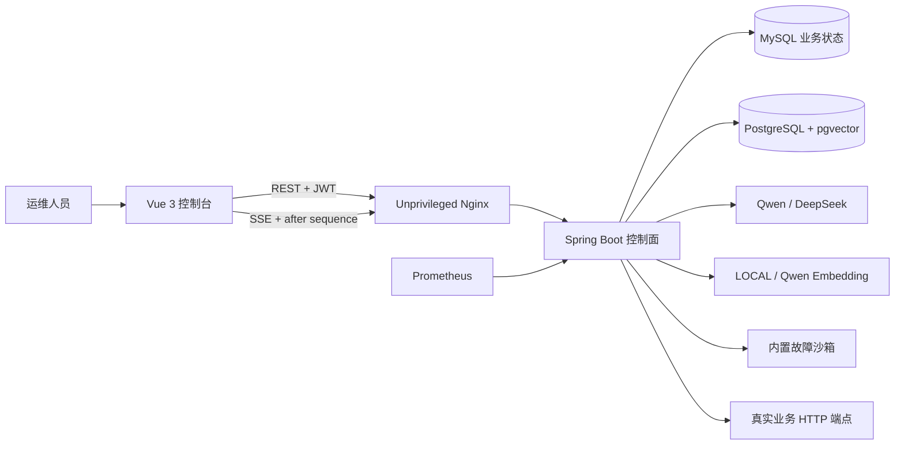
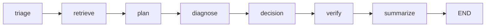

# Ops Agent Platform 项目全景、实现原理与面试指南

本文是一份独立于 README 的深度说明，面向三类读者：第一次接触项目的开发者、需要维护或扩展项目的工程师，以及准备 Java 后端/Java Agent 岗位面试的候选人。

文档以 `feature/foundation` 当前源码为唯一事实依据。凡是写成“已经支持”的能力，都能在当前代码中找到对应实现；凡是尚未实现但适合作为后续演进的内容，都会明确标记为“扩展方案”，不会把规划描述成现状。

## 1. 项目定位

### 1.1 一句话介绍

Ops Agent Platform 是一个以运维工单为入口的 Java 智能运维平台：它使用大模型理解故障、使用 RAG 检索企业知识、使用受控工具采集现场证据，再通过 Java 状态机、工具策略和人工审批完成可审计的诊断与处置闭环。

### 1.2 它解决的核心问题

传统故障处理通常依赖值班人员完成以下工作：

1. 阅读工单并判断故障类别和优先级。
2. 在知识库中查找对应 runbook。
3. 登录不同系统查看健康状态、指标、日志和依赖。
4. 根据零散证据判断根因。
5. 编写处置方案、验证标准和回滚方案。
6. 对高风险操作申请授权。
7. 执行操作并确认系统是否恢复。
8. 将整个过程补写到工单和审计记录中。

本项目把这套流程变成一个可重复、可约束、可回放的 Agent Workflow。大模型提升理解与推理效率，Java 后端保证权限、状态、数据一致性和操作安全。

### 1.3 它不是什么

- 不是通用聊天机器人：输入核心是工单，不是无限开放的聊天消息。
- 不是让模型直接登录服务器：模型没有 Shell、任意 SQL、任意文件系统权限。
- 不是纯 Prompt Demo：任务、步骤、模型调用、工具调用、审批和事件都真实持久化。
- 不是全自动生产运维平台：只有已接入、已建模、已授权的动作才能真实执行。
- 不是 MCP 平台：当前没有 MCP Client、MCP Server 或 MCP 协议传输层。
- 不是全量企业基础设施套件：Prometheus、Loki、Kubernetes、CMDB 等原生适配器仍属于扩展方向。

## 2. 功能全景

| 功能域 | 用户能做什么 | 后端如何实现 | 为什么这样设计 |
|---|---|---|---|
| 登录与租户 | 使用租户编码、用户名和密码登录 | BCrypt 校验密码，JWT 携带租户、用户和角色 | 从身份入口建立租户边界，不信任客户端自报租户 |
| 首页总览 | 查看工单、审批、场景和评测概况 | 聚合各业务 API，前端展示最近工单与能力状态 | 让运维人员先看到待处理事项，而不是技术组件 |
| 工单管理 | 创建、分页筛选、查看、取消工单 | Ticket 聚合、MyBatis Plus 仓储、显式状态机 | 工单是业务主线，Agent 不能脱离工单任意运行 |
| Agent 诊断 | 启动、停止、查看执行时间线和最终结论 | 异步执行器、任务租约、七节点 Graph、持久化事件 | 长任务不阻塞 HTTP，请求过程可审计、可恢复 |
| RAG 知识库 | 初始化内置知识、新增文档、发布版本、语义检索 | 文档分块、Embedding、MySQL 版本元数据、pgvector 检索 | 企业知识可更新、可追溯，避免把整篇文档直接塞入 Prompt |
| 受控工具 | 自动读取健康、指标、日志和依赖 | Java 工具白名单、参数归一化、超时与结果上限 | 模型只能提出调用意图，不能自行获得执行能力 |
| 人工审批 | 查看、批准或拒绝高风险动作 | 独立审批状态机、有效期、原子状态更新、一次性执行 | 将模型建议、人类授权和程序执行分离 |
| 业务系统接入 | 配置真实服务的健康、指标、日志、依赖和变更端点 | 租户级 ManagedService 配置、HTTP 适配器、环境变量凭证 | 用稳定契约接入不同系统，数据库不保存明文 Token |
| 内置故障沙箱 | 使用五种确定性故障演练完整闭环 | YAML 场景目录、Fixture 数据源、进程内场景状态 | 没有真实业务系统时也能稳定开发、演示和回归 |
| 评测中心 | 运行 MOCK 或 LIVE 评测并查询历史结果 | 30 条基线、六类指标、运行与用例结果持久化 | 把“感觉模型不错”变成可比较、可回归的工程指标 |
| 平台状态 | 查看平台及实际依赖健康情况 | Spring Boot Actuator、Micrometer、Prometheus | 明确区分平台自身健康和用户业务系统健康 |
| 审计与恢复 | 查看完整事件，断线后继续，异常后安全恢复 | MySQL 事件序列、SSE 重放、checkpoint、Worker lease | 故障处理中不能因刷新页面或实例异常丢失上下文 |

## 3. 技术栈与各自职责

| 技术 | 当前用途 | 选择原因 |
|---|---|---|
| Java 21 | 后端语言、并发任务、领域与策略实现 | 类型约束强、生态成熟，适合企业控制面和长期维护 |
| Spring Boot 4 | Web、配置、依赖注入、Actuator | 统一 Java 企业应用基础设施，减少框架拼装成本 |
| Spring AI 2 | Qwen/DeepSeek ChatModel 与 EmbeddingModel 适配 | 用统一接口隔离模型供应商差异 |
| Spring AI Alibaba Graph | 七节点 Agent 状态图编排 | 节点边界清晰，便于审计、测试、恢复和扩展 |
| Spring Security | JWT 认证、角色控制、无状态会话 | 安全规则集中，支持方法级授权 |
| MyBatis Plus/JdbcTemplate | 业务实体和高控制度 SQL 持久化 | 简单实体提高开发效率，复杂原子更新保留 SQL 控制力 |
| Flyway | MySQL 与 PostgreSQL 数据库版本迁移 | 数据库结构可复现、可审计，避免手工建表漂移 |
| MySQL 8.4 | 工单、任务、步骤、审批、审计、评测等事务状态 | 适合强一致业务状态和关系约束 |
| PostgreSQL 16 + pgvector | 1024 维知识向量与相似度检索 | 向量与元数据过滤可在同一 SQL 中完成 |
| Vue 3 + TypeScript | 运维控制台 | 组件化、类型安全，适合中后台交互 |
| Pinia + Vue Router | 登录态、用户态和页面路由 | 状态边界清晰，支持刷新后的身份恢复和路由守卫 |
| Axios | REST 请求与统一认证错误处理 | 请求拦截器可统一附加 Bearer Token |
| SSE | Agent 执行时间线和断线重放 | 服务端单向事件流符合任务进度场景，比 WebSocket 更简单 |
| Micrometer + Prometheus | Agent、模型、工具、审批和平台指标 | 与 Spring 生态自然集成，便于后续接入监控系统 |
| Docker Compose | 本地完整环境 | 一次启动 MySQL、pgvector、后端、初始化与前端 |
| JUnit 5、Mockito、Testcontainers、Vitest | 单元、集成和前端回归 | 既覆盖领域逻辑，也验证真实数据库迁移和 HTTP 边界 |

## 4. 整体架构



### 4.1 前后端边界

前端负责展示、输入校验、路由和交互体验，不决定租户权限、任务状态或工具是否允许执行。所有关键校验必须在服务端重复完成。

Nginx 是唯一对宿主机暴露的入口，反向代理 REST、Actuator 和 SSE。MySQL、pgvector 与 Spring Boot 默认只存在于 Compose 内部网络，减少数据库和后端管理端口的暴露。

### 4.2 后端模块边界

| 包 | 主要职责 | 关键入口 |
|---|---|---|
| `identity` | 登录、JWT、用户凭证、TenantContext | `AuthController`、`JwtAuthenticationFilter` |
| `ticket` | 工单聚合、分页查询、状态迁移 | `TicketController`、`TicketService` |
| `agent` | 任务、Graph、预算、事件、恢复 | `AgentTaskController`、`OpsAgentWorkflow` |
| `knowledge` | 文档版本、切分、Embedding、检索 | `DocumentIngestionService`、`PgVectorKnowledgeRetriever` |
| `tool` | 工具目录、风险策略、执行上限 | `ToolPolicyService`、`OpsToolFacade` |
| `simulator` | 沙箱数据与真实服务路由 | `FixtureOpsDataProvider`、`RoutingOpsDataProvider` |
| `integration` | 真实业务系统接入配置 | `ManagedServiceController` |
| `approval` | 审批决策、获批执行、事后验证 | `ApprovalService`、`ApprovalResumeService` |
| `evaluation` | 基线目录、运行、计分和持久化 | `EvaluationRunner`、`EvaluationController` |
| `security` / `audit` | 脱敏、不可信内容、安全审计 | `SensitiveDataRedactor`、`AuditService` |
| `observability` | 关联 ID、Micrometer 指标 | `CorrelationFilter`、`AgentMetrics` |

这种拆分接近六边形/分层架构：领域和应用服务表达业务规则，基础设施实现数据库、模型和外部 HTTP，Web 层只负责协议转换。它的价值不是“目录好看”，而是让模型供应商、数据源和持久化实现可以替换，而不改动核心业务规则。

## 5. 核心领域对象与数据模型

### 5.1 主要聚合

- `Ticket`：故障事件的业务主记录，保存标题、描述、服务、严重程度、场景和状态。
- `AgentTask`：一次 Agent 执行，保存预算、使用量、Worker 租约、取消请求和终态。
- `AgentStep`：Graph 中一个节点的一次执行记录，保存输入快照、输出 checkpoint、耗时和错误摘要。
- `KnowledgeDocument` / Version：知识文档身份与不可变版本。
- `KnowledgeChunk`：可检索的最小知识片段，包含向量、版本和引用坐标。
- `ApprovalRequest`：一次具体高风险工具调用的授权请求。
- `ManagedService`：租户接入的业务服务及端点契约。
- `EvaluationRun` / CaseResult：一次评测及其每条用例结果。

### 5.2 MySQL 中保存什么

MySQL 通过 10 组 Flyway 迁移创建以下核心表：

| 表 | 作用 |
|---|---|
| `tenant`、`user_account` | 多租户身份和 BCrypt 密码 |
| `ticket` | 工单业务状态 |
| `knowledge_document`、`knowledge_document_version` | 文档身份、版本、哈希和发布状态 |
| `agent_task` | Agent 生命周期、预算、租约、错误摘要 |
| `agent_step` | 七节点输入输出和 checkpoint |
| `model_invocation` | 供应商、模型、请求哈希、Token、延迟和结果 |
| `tool_invocation` | 工具、参数哈希、风险、幂等键、结果和延迟 |
| `agent_event` | 可重放的有序任务事件 |
| `approval_request` | 审批参数、状态、过期时间和执行结果 |
| `security_audit_log` | 认证、授权、工具策略和恢复安全事件 |
| `evaluation_run`、`evaluation_case_result` | 评测配置、指标和逐用例证据 |
| `managed_service` | 真实业务系统接入配置 |

### 5.3 pgvector 中保存什么

`knowledge_chunk` 使用 `(tenant_id, document_id, document_version, chunk_index)` 作为主键，保存内容、来源、JSONB 元数据、`vector(1024)` 和发布状态。HNSW 索引使用 cosine distance，提高近似向量检索效率。

### 5.4 为什么使用两种数据库

MySQL 负责强事务业务数据，pgvector 负责向量距离运算。将两者分开可以让关系状态与检索负载独立演进，也更贴近企业中“业务库 + 专用检索库”的部署方式。

代价是知识发布跨两个数据库，无法依赖单库事务。当前实现采用“先创建版本和 chunk，再发布向量和版本状态”的应用级流程；生产规模进一步扩大时，可增加 outbox、补偿任务和发布状态对账。

## 6. 用户功能及实现细节

### 6.1 登录与权限

登录请求包含 `tenantCode`、`username` 和 `password`。后端先按租户和用户名查找凭证，再用 BCrypt 验证密码，成功后签发带 issuer、租户 ID、用户 ID、用户名和角色的 JWT。

之后 `JwtAuthenticationFilter` 解析 Bearer Token 并创建 `TenantPrincipal`，`TenantContext` 从已认证 principal 获取当前租户。业务接口不能从请求头或请求体接受一个可覆盖的租户 ID，因此攻击者无法仅修改 `X-Tenant-Id` 越权访问其他租户。

ADMIN 可以初始化/发布知识、管理业务系统和运行评测；普通 OPERATOR 可以创建和查看工单、运行 Agent、检索知识。当前审批接口允许同租户内任意已认证用户批准或拒绝，这适合本地演示，但生产环境应增加独立 `APPROVER` 角色或明确限制为 ADMIN。

前端目前把 JWT 保存在 `localStorage`，适合本地演示和普通前后端分离实现。生产环境应进一步评估 HttpOnly/SameSite Cookie、刷新令牌、CSP、短 Token 生命周期和统一身份平台，以降低 XSS 窃取 Token 的风险。

### 6.2 工单管理

工单支持创建、详情、分页筛选和取消。创建时可以选择：

- 内置故障场景：绑定一个确定性的 `scenarioKey`。
- 已接入真实服务：使用 `managed:<service-name>` 作为路由键。
- 自定义知识诊断：即使没有实时数据端点，也能依据工单和知识库形成建议。

工单状态不是前端随意赋值，而是由 `TicketStateMachine` 检查：

```text
OPEN → TRIAGING → DIAGNOSING
                      ├→ WAITING_APPROVAL → EXECUTING → VERIFYING → RESOLVED
                      └→ VERIFYING → RESOLVED

任意非终态 → FAILED / CANCELLED / TIMEOUT / MANUAL_REQUIRED
```

显式状态机可以拒绝非法跳转，例如终态工单不能重新变成处理中，未审批的工单不能直接进入执行中。

### 6.3 Agent 任务

点击“启动 Agent 诊断”后，后端会：

1. 校验工单属于当前租户。
2. 创建带默认预算的 `AgentTask`。
3. 使用数据库生成列和唯一索引保证同一工单最多只有一个活跃任务。
4. 将任务提交到独立 `ThreadPoolTaskExecutor`。
5. Worker 原子抢占任务租约，将任务从 `QUEUED` 转为 `RUNNING`。
6. 执行七节点 Graph。
7. 将最终结果同步回工单状态。

默认预算为 12 个步骤、3 分钟和 20000 Token。线程池默认核心线程 2、最大线程 8、队列 32。队列饱和时启动请求会明确失败，不会无限堆积耗尽内存。

### 6.4 知识库

管理员可以初始化五份官方来源知识、新增文档或给已有文档发布新版本。普通用户可以执行语义检索，但不能修改知识。

内置初始化按 `source` 和当前租户幂等：同一租户重复点击不会创建重复文档，不同租户可以拥有各自独立的一套初始知识。初始化仍调用正式 `DocumentIngestionService`，不是绕过业务层直接插入数据库。

### 6.5 业务系统接入

管理员为服务配置：服务唯一名、所属系统、环境、Base URL、健康路径，以及可选的指标、日志、依赖和操作路径。

凭证字段保存的是环境变量名，例如 `ORDER_SERVICE_TOKEN`，而不是 Token 本身。发起请求时后端从进程环境读取值并设置 Bearer Header。

URL 校验只允许 HTTP/HTTPS，禁止 URL 用户信息、查询参数、片段以及已知云元数据地址；路径必须以 `/` 开头。需要注意：这属于基础 SSRF 防护，并不等于完整生产防护。生产还应增加目标域名/IP allowlist、DNS 重绑定防护、出站代理、网络策略和重定向限制。

### 6.6 人工审批

高风险动作生成审批记录并暂停任务。审批记录包含工具名、归一化参数、风险、过期时间和状态。批准/拒绝使用带期望状态的原子更新，因此并发点击只有一个请求能成功。

批准不是“直接改数据库为成功”，而是触发独立执行服务。该服务重新检查租户、审批和工具策略，再凭一次性审批 ID 与幂等键执行动作。当前批准/拒绝要求已认证并受租户隔离，但尚未设置专用审批角色，这是生产化前需要收紧的权限点。

### 6.7 评测中心

评测集固化 30 条用例，分为：

- `CLASSIFICATION`：故障分类是否正确。
- `RETRIEVAL`：是否召回正确知识和引用。
- `TOOL_USE`：工具选择与参数是否准确。
- `END_TO_END`：端到端根因和处置结果。
- `APPROVAL`：高风险动作是否被拦截并等待审批。
- `ATTACK`：提示注入、越权工具和敏感信息泄漏防护。

MOCK 使用确定性适配器但复用生产 Graph 和 Java 策略，适合作为 CI 门禁；LIVE 调用真实 Qwen/DeepSeek，适合衡量真实效果、Token 成本和延迟。两者分开存储和展示，避免把不稳定的在线模型结果当作唯一回归标准。

## 7. Agent 的运行原理

### 7.1 为什么它可以被称为 Agent

一个工程化 Agent 通常至少包含目标、状态、推理、工具、环境反馈和停止条件。本项目对应关系如下：

| Agent 概念 | 本项目实现 |
|---|---|
| 目标 | 解决一张具体运维故障工单 |
| 状态 | `OpsAgentState`、`AgentTask`、`AgentStep` |
| 推理 | Qwen/DeepSeek 的结构化分类、规划和决策 |
| 工具 | 健康、指标、日志、依赖、知识、重启和配置变更 |
| 环境反馈 | Fixture 或 Managed HTTP Service 返回的真实观察 |
| 策略与边界 | Java allowlist、风险分级、租户与审批校验 |
| 停止条件 | 成功、失败、等待审批、超时、取消、转人工 |

它不是完全自由规划的 Autonomous Agent，而是受工作流约束的 Workflow Agent。对于生产运维，这种受控性通常是优点：可预测、可测试、可审计，且不会因为模型临时改变思路而绕过安全规则。

### 7.2 七节点 Graph



| 节点 | 是否调用模型 | 详细职责 |
|---|---:|---|
| `triage` | 是 | 把不可信工单内容分类为固定类别和紧急程度，要求严格 JSON |
| `retrieve` | 否 | 使用工单标题和描述检索最多 5 条租户知识证据 |
| `plan` | 是 | 从四个只读诊断工具中生成计划；当前 Prompt 要求完整诊断时四个工具各一次 |
| `diagnose` | 否 | Java 逐个执行工具，记录参数、风险、结果、延迟和错误 |
| `decision` | 是 | 综合证据与观察，输出根因、摘要、动作、置信度、步骤、验证和回滚 |
| `verify` | 否 | 用确定性规则把高风险动作路由到审批，否则转人工处理 |
| `summarize` | 否 | 形成最终报告、引用列表，并把验证结果提交为任务终态 |

模型不是每个节点都调用。检索、真实工具执行、风险判断和总结状态提交由 Java 完成，减少成本并缩小不确定性范围。

### 7.3 `OpsAgentState` 的作用

Graph 节点共享一个有类型的状态对象，包含：

- 任务命令和预算。
- 当前步骤、Token 使用量和开始时间。
- 分类结果与紧急程度。
- RAG 证据和 citation。
- 计划工具和工具观察。
- 根因、诊断摘要、置信度和建议动作。
- 处置步骤、验证标准和回滚方案。
- checkpoint、错误和最终状态。

它是“单次工作流记忆”，不是聊天记忆。它解决节点之间如何传递上下文、如何持久化恢复的问题，但不会自动保存用户多轮聊天历史。

### 7.4 结构化输出如何保证可靠性

`triage`、`plan` 和 `decision` 都要求模型返回 JSON，并反序列化到 Java record。处理流程是：

1. 对 Prompt 进行敏感信息脱敏。
2. 调用指定模型供应商。
3. 去除可能存在的 Markdown code fence。
4. 截取 JSON 对象并反序列化。
5. 首次解析失败时，再调用一次模型执行 JSON repair。
6. 再次失败则任务明确失败。
7. 解析成功后继续做 Java 字段、枚举、范围和参数结构校验。

仅依赖“提示模型输出 JSON”是不够的。模型输出必须经过解析和业务校验，错误结果不能静默进入执行层。

### 7.5 模型供应商如何切换

`ModelGateway` 屏蔽供应商差异，`SpringAiModelGateway` 按 `ModelProvider` 选择对应 `ChatModel`。Qwen 和 DeepSeek 都通过 OpenAI 兼容接口接入，Graph 节点只依赖统一的 `ModelGateway`。

当前默认模型：

- Qwen：`qwen-plus`。
- DeepSeek：`deepseek-chat`。
- Qwen Embedding：`text-embedding-v4`，输出 1024 维。

DeepSeek 当前只负责对话推理，不负责知识向量。Embedding 使用 LOCAL 或 Qwen。

### 7.6 模型未配置时为什么平台仍能启动

控制面、登录、工单、数据库、沙箱、LOCAL Embedding 和 MOCK 评测不依赖云端模型 Key。因此应用可以正常启动并体验大量功能。

但 LIVE Agent 进入首个模型节点时会明确报 `Model provider is not configured`，任务进入失败状态并展示真实错误。这样可以区分“平台可运行”和“真实模型已配置”，避免用假结果伪装成功。

## 8. RAG 的完整实现

### 8.1 入库链路

```text
请求校验
  → UTF-8 大小限制（2 MiB）
  → 换行与空白标准化
  → 按 Markdown 标题分节
  → 超长分节按边界切成最多 1200 字符的 chunk
  → 批量生成 1024 维向量
  → MySQL 创建文档/版本与 SHA-256
  → pgvector 写入 chunk
  → 发布 chunk 和文档版本
```

文档版本不可用简单覆盖代替。保留版本有三个价值：可以审计某次诊断使用了哪版知识，可以让新版本发布前不影响旧版本，也可以在评测中固定 knowledge version。

### 8.2 检索链路

1. 拼接工单标题和描述作为查询。
2. 使用与入库一致的 Embedding Gateway 生成一个 1024 维向量。
3. SQL 强制过滤当前 `tenant_id`。
4. 只检索已经发布的 chunk。
5. 每个文档只使用最新已发布版本。
6. 使用 cosine similarity：`1 - (embedding <=> queryVector)`。
7. 在数据库侧过滤低于 `KNOWLEDGE_MIN_SCORE` 的结果。
8. 按距离排序并返回 Top K，Agent 默认 Top 5。

### 8.3 Citation 为什么重要

每条证据拥有如下不可变定位：

```text
tenant:{tenantId}:doc:{documentId}:v{version}:chunk:{chunkIndex}
```

最终结论保留 citation，用户可以追踪建议来自哪一租户、哪份文档、哪个版本、哪个片段。它不能证明结论一定正确，但能显著提高可解释性和审计能力。

### 8.4 LOCAL Embedding 的定位

LOCAL 是确定性的 Hash/词法向量器，用于无 API Key 情况下验证“切分、入库、租户过滤、向量 SQL 和引用”整条工程链路。它不应被描述为与生产语义模型效果相同。

LOCAL 与 Qwen 生成的向量空间不同，不能在同一批语料中混用。切换 Embedding Provider 后应重新入库并重新标定相似度阈值。

### 8.5 如何降低 RAG 幻觉

当前已经采用：租户过滤、发布版本过滤、最低分阈值、Top K 限制、citation、不可信证据包装、知识与实时工具联合判断。

后续可继续增加：Hybrid Search、BM25、Reranker、查询改写、metadata filter、文档权限 ACL、过期知识检测、答案忠实度评测和无证据拒答策略。

## 9. Tool Calling 与外部系统

### 9.1 当前是不是原生 Function Calling

不是模型供应商原生的自动 Function Calling 循环。当前实现是更受控的两阶段方式：

1. `plan` 节点让模型在 Prompt 中返回工具名称列表。
2. Java 校验列表只能包含只读 allowlist。
3. `diagnose` 节点通过 `DiagnosticToolGateway` 和 `OpsToolFacade` 执行。

高风险工具同样由模型在 `decision` 中提出，但只有 Java 审批链路能够真正调用。这种方式可移植、可测试、控制力强；代价是工具规划灵活度不如完整 ReAct/Function Calling 循环。

### 9.2 工具清单

| 工具 | 风险 | 是否自动执行 | 限制 |
|---|---|---:|---|
| `getServiceHealth` | READ_ONLY | 是 | 5 秒超时，单结果 |
| `queryMetrics` | READ_ONLY | 是 | 最多 500 个指标点 |
| `queryLogs` | READ_ONLY | 是 | 最多 200 行、32 KiB，并脱敏 |
| `getServiceDependencies` | READ_ONLY | 是 | 最多 100 个依赖 |
| `searchRunbook` | READ_ONLY | 是 | 最多 20 条知识结果 |
| `restartService` | HIGH_RISK | 否 | 必须审批、审批 ID、幂等键 |
| `changeConfig` | HIGH_RISK | 否 | 必须审批、非空 changes、幂等键 |

未知工具直接拒绝。项目没有提供任意 Shell、任意 SQL、任意 URL 抓取或文件写入工具。

### 9.3 沙箱和真实服务如何路由

`RoutingOpsDataProvider` 根据 `scenarioKey` 决定数据来源：

- 命中内置场景：委托 `FixtureOpsDataProvider`。
- 非内置场景：按当前租户和服务名查找 `ManagedService`。
- 未接入服务：健康返回 UNKNOWN，其他实时数据为空，自动写操作禁止。

上层 Agent 不需要知道数据来自沙箱还是真实 HTTP。这个端口/适配器设计便于后续增加 Prometheus、Loki、Kubernetes、云监控或 CMDB 实现。

### 9.4 真实服务 HTTP 契约

- 健康：`GET healthPath`，读取 `status`，兼容 `UP`/`HEALTHY`。
- 指标：`GET metricsPath`，支持 `{metric}` 占位符和 Actuator `measurements`。
- 日志：`GET logsPath`，支持数组或 `{ "logs": [...] }`。
- 依赖：`GET dependenciesPath`，支持 `dependencies` 或 Actuator `components`。
- 变更：审批后 `POST operationsPath`，发送 `operation`、`service`、`parameters`、`taskId`。

HTTP 连接超时 3 秒，单次请求超时 5 秒。非 2xx、无效 JSON、凭证缺失都会转化为明确失败，进入 Agent 审计和安全终态。

## 10. 审批、幂等和事后验证

### 10.1 为什么模型不能自己审批

模型既是建议生成者又是审批者会形成权限闭环：只要 Prompt 被污染或模型误判，就可能直接执行生产变更。因此审批状态必须保存在模型之外，并由具备角色权限的人类显式决策。

### 10.2 完整执行链路

```text
decision 提出 restartService/changeConfig
  → verify 标记 WAITING_APPROVAL
  → 创建 PENDING 审批
  → 租户内已认证用户批准
  → 原子抢占为 EXECUTING
  → 重新执行 ToolPolicyService
  → AgentTask WAITING_APPROVAL → RUNNING
  → Ticket WAITING_APPROVAL → EXECUTING
  → 携带审批 ID 和幂等键调用工具
  → Ticket → VERIFYING
  → 再次调用 getServiceHealth
  → 确认 UP/RECOVERED 后 Task SUCCEEDED、Ticket RESOLVED
```

### 10.3 幂等如何实现

高风险工具调用必须携带 `idempotencyKey`。数据库对 `(tenant_id, task_id, tool_name, idempotency_key)` 建立唯一约束。重复请求如果参数哈希相同，会复用已有调用身份；同一幂等键配不同参数则直接报错。

这能防止网络重试、重复点击和 Worker 恢复造成同一变更被执行多次。但外部业务系统也应支持自己的幂等语义，因为平台数据库唯一约束无法完全消除“请求已到达远端但本地未收到响应”的分布式不确定性。

### 10.4 为什么执行后还要验证

HTTP 返回成功只说明目标端点接受了请求，不代表业务已恢复。平台会再次执行只读健康检查，只有健康状态为 `UP` 且场景状态为 `RECOVERED` 才记录 `POST_ACTION_VERIFIED`。

如果写操作后 Worker 租约过期，且没有可证明成功的执行记录，恢复逻辑不会盲目重试，而是将任务置为 `MANUAL_REQUIRED`。这是安全性优先于自动化完成率的设计。

## 11. 状态、并发和故障恢复

### 11.1 AgentTask 状态机

```text
QUEUED → RUNNING
RUNNING → WAITING_APPROVAL / SUCCEEDED / FAILED / CANCELLED / TIMED_OUT / MANUAL_REQUIRED
WAITING_APPROVAL → RUNNING / CANCELLED / TIMED_OUT / MANUAL_REQUIRED
```

数据库更新携带 expected status，使用受影响行数判断是否成功，避免两个线程同时把同一任务推进到不同状态。

### 11.2 Worker Lease

Worker 执行前原子写入 `worker_id` 和 `lease_until`。后台恢复任务定期扫描租约已过期的 RUNNING 任务，并尝试重新抢占。这样可以避免多个实例同时执行，同时为进程崩溃后的恢复提供依据。

### 11.3 Checkpoint

每个节点完成后把状态快照写入 `agent_step.output_data`。恢复服务查找最后一个成功的七节点步骤，将其构造成 `RecoveryCheckpoint`，Graph 从对应节点之后继续，而不是从头重复所有只读调用。

写操作恢复更加保守：若可以从持久化执行记录证明成功，则幂等完成；否则转人工，不自动重放不确定写操作。

### 11.4 取消与超时

取消不是粗暴杀死线程。用户请求取消后写入 `cancel_requested_at`，节点边界、模型调用后和工具调用间隙都会检查取消标志。任务预算在控制点检查步骤、Token 和时间，超过限制进入 `TIMED_OUT`。

这种协作式取消不会中断已经发出的远端写操作，因此高风险写操作仍需要幂等和恢复保护。

## 12. SSE 时间线与前端实现

### 12.1 为什么使用 SSE

Agent 进度主要是服务端向浏览器单向推送，用户操作仍通过普通 REST 完成。SSE 基于 HTTP，支持事件 ID、浏览器流式读取和代理转发，比为此引入双向 WebSocket 更简单。

### 12.2 如何避免断线丢事件

事件并非只发布到内存：

1. 后端先在 `agent_event` 表为任务分配递增 sequence 并落库。
2. 再向当前内存订阅者发布。
3. 前端保存最后接收的 sequence。
4. 重连 `/events?after={sequence}`。
5. 后端分页重放遗漏历史，再无缝接入实时流。

`WAITING_APPROVAL` 不是最终结束。前端在收到等待审批状态后允许后续重连，审批完成后的执行和验证事件仍会追加到同一时间线。

### 12.3 为什么处理 Long ID

Java/MySQL 的 BIGINT 可能超过 JavaScript 安全整数 `2^53-1`。后端对超出安全范围的 Long 序列化为十进制字符串，前端统一使用 `string | number`，路由参数不做 `Number()` 转换，防止工单或任务 ID 被静默改写。

## 13. 安全设计

### 13.1 多租户隔离

- 租户 ID 由认证 principal 进入 `TenantContext`。
- 工单、任务、知识、审批、业务系统和评测查询都带 tenant 条件。
- 关键外键包含 `(id, tenant_id)` 组合，数据库层进一步约束关联租户一致。
- pgvector SQL 同样强制 `tenant_id` 过滤。

### 13.2 Prompt Injection 防护

工单、知识片段和工具结果都被视为不可信数据。Prompt 明确声明其中的命令和权限声明不能改变策略，`UntrustedContentPolicy` 对证据形成受控 envelope。

更关键的是，真实权限存在 Java 层：即使模型被诱导输出 `deleteDatabase`，工具白名单也会拒绝；即使模型要求跳过审批，高风险工具仍缺少审批 ID 和幂等键。

### 13.3 敏感信息保护

- 数据库只保存业务服务 Token 的环境变量名。
- Prompt、步骤错误、调用错误和 UI 边界进行敏感信息脱敏。
- 模型调用表保存 request hash，不保存完整 Prompt。
- 指标标签不使用 tenant、ticket、task、原始 Prompt 和原始错误，避免高基数和泄漏。

### 13.4 安全边界仍可改进之处

- 生产认证应接入 SSO/OIDC，并改进浏览器 Token 存储策略。
- 出站 HTTP 应使用域名/IP allowlist、网络隔离和企业代理。
- 密钥应由 KMS/Vault 管理并支持轮换。
- 文档可进一步支持用户/部门级 ACL，而不仅是租户级隔离。
- 操作端点应采用双向 TLS、请求签名和独立服务身份。

## 14. 评测与可观测性

### 14.1 为什么 Agent 必须有评测

普通接口可以断言固定输入输出，而模型输出具有概率性。Agent 还同时涉及检索、工具、审批和安全，单看最终回答无法定位问题。因此评测必须拆分多个维度。

持久化指标包括：通过率、分类/根因准确率、工具 precision/recall、参数准确率、引用准确率、解决准确率、审批拦截率、泄漏数、平均步骤、平均 Token、P50/P95 延迟。

### 14.2 MOCK 与 LIVE 的职责

- MOCK：确定性、低成本、适合每次提交运行，验证 Graph 和 Java 边界没有退化。
- LIVE：真实供应商、存在成本和波动，验证模型效果、Prompt 兼容性和延迟。

合理门禁方式是 MOCK 必须稳定通过，LIVE 定期抽样并按模型/Prompt/知识版本对比，而不是要求每次构建都调用昂贵模型。

### 14.3 运行时可观测性

系统记录任务状态、节点耗时、模型调用、Token、工具调用、审批结果和恢复事件。HTTP、线程池和 Graph 节点传播 `trace_id`、`tenant_id`、`ticket_id`、`task_id` 和 `step_id`，线程复用前清理上下文。

Actuator 暴露 health、info 和 Prometheus；health 可匿名用于容器探针，info/prometheus 只允许 ADMIN。

## 15. 部署与测试

### 15.1 Compose 拓扑

`compose.yml` 启动：

1. MySQL 8.4。
2. pgvector/pgvector:pg16。
3. Spring Boot Server。
4. demo-seed 初始化演示租户和账号。
5. Nginx + Vue Web。

只有 Web 端口默认映射到宿主机。服务依赖 healthcheck 控制启动顺序，数据使用命名 volume 持久化。

### 15.2 当前验收基线

- 99 个后端单元测试。
- 58 个 Testcontainers 集成测试。
- 13 个前端测试。
- Vue TypeScript 检查与 Vite 生产构建。
- Docker Compose 配置、镜像构建和真实 Smoke。
- Smoke 覆盖登录、权限、知识入库、pgvector 检索、跨租户隔离、工单、Agent 边界与 30 条 MOCK 评测。

### 15.3 为什么使用 Testcontainers

H2 无法完整模拟 MySQL 的生成列、JSON、检查约束、事务行为，也无法模拟 PostgreSQL pgvector。Testcontainers 使用真实 MySQL/pgvector 镜像验证 Flyway 和 SQL，能提前暴露“本地单元测试通过、部署数据库失败”的问题。

## 16. 关键设计决策：为什么这样做

### 16.1 为什么选择固定 Graph，而不是完全自由的 ReAct

运维操作需要稳定边界。固定 Graph 可以明确每一步允许读取和写入哪些状态，也更容易做步骤预算、测试、事件展示和 checkpoint 恢复。完全自由的 ReAct 更灵活，但调用次数、路径和终态更难预测，生产写操作风险更高。

项目选择“固定主流程 + 节点内模型推理”：把需要创造性的分类和根因分析交给模型，把工具、审批和状态交给 Java。这是效果与工程可控性的折中。

### 16.2 为什么不用一个大 Prompt 一次生成最终答案

单次 Prompt 无法可靠获得最新系统状态，也难以区分“知识推测”和“现场事实”。拆成节点后可以：

- 在推理前检索知识。
- 按计划采集实时数据。
- 对每次模型/工具调用单独审计。
- 在任一节点失败时准确定位。
- 从安全 checkpoint 恢复。
- 对分类、检索、工具和决策分别评测。

### 16.3 为什么模型只给建议，Java 决定权限

Prompt 是软约束，可能被误解或注入；Java allowlist、角色、租户、数据库状态和审批是硬约束。任何安全关键规则如果只存在于 Prompt 中，就无法作为可靠授权机制。

### 16.4 为什么写操作必须人工审批

重启和配置变更具有真实副作用，根因判断又具有概率性。Human-in-the-loop 能在关键边界加入业务上下文、责任确认和审计证据。审批只针对一次具体工具和参数，避免一次批准变成长期权限。

### 16.5 为什么没有真实数据也不伪造成功

未接入服务时，健康状态返回 UNKNOWN，其他实时工具返回空结果，写操作禁止；未配置模型时任务明确失败。系统宁可承认“证据不足”，也不把沙箱数据或模板回答伪装成真实生产结论。

### 16.6 为什么事件要先落库再推送

如果先推送再落库，浏览器可能看见一个永远无法重放的事件；断线后也无法判断丢了什么。先落库再推送使数据库成为事实来源，内存流只承担低延迟通知。

### 16.7 为什么知识引用包含版本和 chunk

只记录文档名会在文档更新后失去可复现性。版本和 chunk 可以定位当时真正提供给模型的证据，为审计和评测提供稳定坐标。

### 16.8 为什么任务和工单是两个状态机

工单代表业务事件，AgentTask 代表一次技术执行。一张工单可以有历史任务，任务失败也不等于数据记录不存在。分开建模可以避免把线程状态、租约和 Token 预算污染到工单聚合中，也便于未来支持人工处置、再次诊断或其他 Agent。

## 17. 当前 Agent 是否支持持续对话

### 17.1 结论

**当前版本不支持用户可见的持续多轮对话。**

当前系统支持的是“一张工单对应一次或多次独立 Agent 任务，每次任务内部有多节点上下文”。它具备持久化工作流状态、SSE 事件、任务恢复和历史结果，但没有以下聊天能力：

- 没有 `conversation` / `message` 数据表。
- 没有发送追问消息的 API。
- 没有 `conversationId` 或会话生命周期。
- 没有把历史 user/assistant message 重新组装进上下文窗口。
- 没有对长会话做摘要、滑动窗口或 Token 淘汰。
- 没有跨任务的用户偏好或长期记忆。

### 17.2 为什么多节点状态不等于多轮对话

`OpsAgentState` 会在 `triage → retrieve → plan → diagnose → decision` 之间传递数据，这是一种 Workflow State。它的参与者主要是程序节点，不是用户和 Assistant 轮流发消息。

多轮对话要求用户在第一次回答后继续追问、补充证据或修正目标，并让模型理解历史语义。当前前端只有“启动任务、查看事件、审批、取消”，没有“继续提问”。

### 17.3 为什么当前项目优先做工单工作流

对于运维处置，结构化工单比开放聊天更容易审计和授权。每次执行都有确定输入、预算和终态；高风险动作可以绑定到具体任务、工具和参数。若一开始就做无限对话，必须同时解决历史污染、上下文膨胀、指令优先级、会话并发和“聊天中一句话是否代表授权”等问题。

### 17.4 如何扩展为可持续对话 Agent

推荐新增以下模型：

```text
ConversationSession
  id, tenantId, ticketId, createdBy, status,
  summary, lastMessageSequence, createdAt, updatedAt

ConversationMessage
  id, sessionId, tenantId, sequence, role,
  content, tokenCount, model, citations, createdAt

ConversationTurn
  id, sessionId, userMessageId, assistantMessageId,
  agentTaskId, status, idempotencyKey
```

建议 API：

```text
POST /api/tickets/{ticketId}/conversations
GET  /api/conversations/{conversationId}
GET  /api/conversations/{conversationId}/messages?after=...
POST /api/conversations/{conversationId}/messages
GET  /api/conversations/{conversationId}/events?after=...
```

一次追问的推荐流程：

1. 校验会话、工单和当前用户属于同一租户。
2. 使用幂等键写入用户消息。
3. 加载系统指令、会话摘要、最近 N 条消息和工单事实。
4. 对历史消息做 Token 预算计算。
5. 需要新证据时启动新的只读诊断任务，而不是沿用过期观察。
6. 输出回答并保存 assistant message、引用和所用模型。
7. 长会话超过阈值时生成结构化摘要，但保留原始消息供审计。

### 17.5 对话模式下仍要保留的安全边界

- 聊天消息不能直接代表审批。
- “帮我重启”只能生成待确认动作，仍要进入现有审批聚合。
- 历史消息和会话摘要都属于不可信上下文。
- 新一轮执行前应重新检查实时健康，不能复用数小时前的工具观察。
- 一个会话同一时刻只允许一个生成中的 Turn，或使用 sequence 做乐观并发控制。
- 会话记忆按 tenant 和 ticket 隔离，不能做无边界的全局用户记忆。

### 17.6 短期记忆、长期记忆和工作流状态的区别

| 类型 | 保存内容 | 生命周期 | 本项目现状 |
|---|---|---|---|
| 工作流状态 | 分类、证据、工具结果、根因 | 单次 AgentTask | 已实现 |
| 短期对话记忆 | 最近多轮 user/assistant 消息 | 单个会话 | 未实现 |
| 会话摘要 | 被压缩的历史目标和结论 | 长会话 | 未实现 |
| 长期业务记忆 | Runbook、历史事故、组织知识 | 跨会话 | 知识库已实现一部分 |
| 用户偏好记忆 | 个人习惯、偏好和上下文 | 跨会话/用户 | 未实现 |

## 18. Agent 开发高频面试题与参考回答

以下答案按照当前项目组织。面试时应先给结论，再补充实现和取舍，不要只堆技术名词。

### 18.1 你的项目为什么算 Agent，而不是普通的大模型调用

参考回答：

> 普通模型调用通常是一次输入得到一次文本输出。我的项目给 Agent 定义了明确目标、持久化状态、七节点决策流程、RAG 知识、环境工具、反馈和停止条件。模型会根据工单和证据规划只读工具并形成根因决策，但 Java 层控制权限、审批和终态。因此它是受工作流约束的 Tool-using Agent，而不是单纯调用 Chat API。

### 18.2 你的 Agent 是自主 Agent 还是 Workflow Agent

> 它是 Workflow Agent。主流程固定为分类、检索、规划、调查、决策、校验和总结，模型只在部分节点做概率推理。这样牺牲了一部分自由规划能力，换来可预测、可测试、可审计和可恢复，适合有生产副作用的运维场景。

### 18.3 为什么选择 Graph 编排

> Graph 把复杂任务拆成明确节点，每个节点都能记录输入、输出、耗时和错误。相比一个大 Prompt，它便于局部测试、评测和恢复；相比完全自由 ReAct，它能限制路径和工具。当前虽然是线性七节点，但审批形成了跨任务暂停/恢复分支，后续也可以增加条件边和并行调查节点。

### 18.4 Spring AI 在项目中做了什么

> Spring AI 主要负责统一 ChatModel 和 EmbeddingModel 接口。Qwen 与 DeepSeek 的对话模型通过统一网关调用，Qwen Embedding 也封装在 `EmbeddingGateway` 后面。业务 Graph 不依赖具体 SDK，因此切换供应商时核心节点不需要重写。Graph 编排本身使用 Spring AI Alibaba Graph。

### 18.5 为什么不直接使用模型原生 Function Calling

> 当前采用受控 Tool Calling：模型输出工具名和动作，Java 再做白名单、参数、租户、风险和审批校验后调用。原生 Function Calling 可以减少解析代码并支持更灵活循环，但不能替代服务端授权。对于运维写操作，我优先选择控制力和可测试性。后续即使接入原生 Function Calling，最终调用仍必须经过同一 ToolPolicyService。

### 18.6 当前有没有使用 MCP

> 没有。当前工具是进程内 Java Tool Gateway，真实系统通过 Managed HTTP Service 适配。MCP 是标准化工具发现和调用协议，适合连接外部工具服务器，但协议标准化不代表自动安全。后续可以实现 `McpOpsDataProvider` 或 MCP Tool Adapter，把 MCP 工具映射到现有 ToolDescriptor，继续复用租户、allowlist、审批、超时和审计策略。

### 18.7 如果增加 MCP，你会怎么设计

> 我不会让模型直接连接任意 MCP Server。会先建立管理员维护的 Server Registry，固定地址、认证、允许工具和租户范围；启动时同步工具 schema，映射到内部稳定工具名；每次调用经过 ToolPolicyService；高风险 MCP Tool 仍进入审批；结果做大小限制、脱敏和 schema 校验；审计记录 server、tool、参数哈希、延迟和结果。还要防止工具描述本身成为提示注入载体。

### 18.8 Agent 支持持续对话吗

> 当前不支持用户多轮对话。它支持的是单任务内部的多节点状态和持久化恢复，这不等于 Chat Memory。项目没有 conversation/message 表和追问接口。我优先实现工单闭环，因为运维授权要绑定确定任务。如果扩展，会新增会话和消息模型、上下文窗口、摘要与 Token 管理，但执行动作仍走独立审批，不能把聊天文本当授权。

### 18.9 你的 Agent 有 Memory 吗

> 有工作流记忆和知识记忆，但没有聊天记忆。`OpsAgentState` 和 checkpoint 是单任务工作流记忆；pgvector 中的 runbook 是跨任务业务知识。用户多轮消息、会话摘要和个人长期偏好目前没有实现。面试时我会明确区分这三类 memory，避免把数据库持久化都称为 Chat Memory。

### 18.10 页面上的流式输出是什么

> 页面使用 SSE 流式接收任务事件，不是模型逐 Token Streaming。模型网关具备 stream 适配方法，但生产七节点 Graph 当前使用同步结构化 call，因为节点必须获得完整 JSON 后校验。SSE 推送节点开始/完成、工具、审批和终态，并支持按 sequence 断线重放。

### 18.11 为什么使用 SSE 而不是 WebSocket

> 当前主要是服务端向浏览器单向推送执行进度，用户命令继续走 REST。SSE 更轻量，基于普通 HTTP，天然有 event id，易于经过 Nginx。WebSocket 更适合高频双向交互；如果未来做实时多轮语音或协同操作，再考虑 WebSocket。

### 18.12 RAG 的完整链路是什么

> 入库时对 Markdown 标准化、按标题分节、限制 chunk 长度、批量生成 1024 维向量，同时在 MySQL 保存文档版本，在 pgvector 保存 chunk。检索时对工单生成查询向量，按 tenant、published 和最新版本过滤，使用 cosine similarity、最低分阈值和 Top K，返回内容与 citation。最终模型同时接收知识证据和实时工具观察。

### 18.13 为什么不能混用不同 Embedding 模型

> 不同模型学习到的向量空间坐标含义不同，即使维度相同，向量距离也没有可比性。查询用 Qwen、文档用 LOCAL 会导致相似度失真。因此切换 Provider 后需要重新入库，生产还应在 chunk 元数据中显式保存 embedding model/version 并按版本过滤。

### 18.14 chunk 为什么按标题和长度切

> 标题通常代表语义边界，先按标题切比固定字符切更容易保持主题完整；超长章节再按换行或空格做有界切分，控制 Prompt 和向量粒度。当前是工程上简单可靠的基线，后续可以引入 token-aware splitter、父子 chunk 或语义切分，并用检索评测决定是否更好。

### 18.15 如何设置 Top K 和相似度阈值

> 当前 Agent Top K 为 5，最低分默认 0.25。它们不是通用真理，需要根据语料、Embedding 模型和评测集标定。K 太小会漏召回，太大会增加噪声和 Token；阈值太高会无结果，太低会引入无关证据。应结合 Recall@K、MRR、答案忠实度和实际失败样本调整。

### 18.16 如何减少模型幻觉

> 第一，用 RAG 和实时工具给模型提供事实；第二，要求结构化输出并做 Java 校验；第三，模型不能直接执行动作；第四，知识保留 citation；第五，没有证据时允许 NONE/MANUAL_REQUIRED，而不是强制给自动操作；第六，用 MOCK/LIVE 评测持续发现退化。后续可加 reranker、事实一致性评测和基于证据的拒答。

### 18.17 如何处理模型输出不是合法 JSON

> 先去掉 code fence、截取 JSON 对象并反序列化；失败后只允许一次 repair 调用；仍失败则任务 FAILED。解析成功后继续做枚举、空值、置信度范围、工具白名单和 changeConfig 参数结构校验。不能把“能解析”当作“业务合法”。

### 18.18 Prompt Injection 怎么防

> Prompt 中把工单、知识和工具结果标记为 untrusted data，并做敏感信息脱敏；但核心防线不依赖 Prompt。工具 allowlist、租户校验、角色、审批和幂等全部在 Java/数据库层。即使模型被诱导，最多产生一个被策略拒绝的建议，不能给自己授权。

### 18.19 如何保证多租户隔离

> JWT principal 确定 tenantId，服务从 TenantContext 获取而不是信任请求参数。所有仓储和 pgvector SQL 带 tenant 条件，关键关系使用 `(id, tenant_id)` 复合外键，接口测试覆盖跨租户 404/隔离。需要注意 ThreadLocal 在线程池传播和 finally 清理，避免线程复用串租户。

### 18.20 高风险工具为什么要幂等

> 网络超时无法判断远端是否已执行，Worker 恢复和用户重复点击也会造成重试。项目要求高风险调用有幂等键，并在数据库建立唯一约束、保存参数哈希。相同键相同参数复用记录，不同参数拒绝。真正生产中远端操作 API 也必须识别幂等键，才能形成端到端保证。

### 18.21 如果数据库写成功但 SSE 推送失败怎么办

> 数据库是事实来源。事件先落库再推送，推送失败只影响当前连接；浏览器重连时使用 after sequence 重放。不能反过来先推送，因为那会产生用户看见但系统无法恢复的幽灵事件。

### 18.22 Agent 服务崩溃后如何恢复

> Worker 使用 lease。恢复 Job 扫描租约过期的 RUNNING 任务，重新抢占后从最后成功 checkpoint 继续。只读节点可以安全恢复；写操作若有成功记录则幂等完成，若结果不明确则转 MANUAL_REQUIRED，不盲目重复执行。

### 18.23 如何限制 Agent 成本和失控循环

> 每个任务有最大步骤、超时和最大 Token 三重预算，节点边界执行控制点检查；线程池和队列也有上限。当前固定 Graph 本身没有无限 ReAct 循环。模型调用记录 Token 和延迟，LIVE 评测默认只选择少量冒烟用例并提示费用。

### 18.24 Qwen 和 DeepSeek 如何选择

> 当前两者都通过统一 ModelGateway 接入。选择要基于自己的 LIVE 评测，比较结构化输出成功率、根因准确率、延迟、成本和稳定性，而不是只凭排行榜。Qwen 还承担 Embedding，部署链路更统一；DeepSeek 可作为对话模型替代或对照，但不能直接替代当前 Qwen Embedding。

### 18.25 为什么模型请求只存 hash

> 完整 Prompt 可能包含工单、日志和知识内容，直接持久化会扩大敏感信息暴露面。项目保存 SHA-256、供应商、模型、Token、延迟和错误，用于关联与统计。缺点是无法仅靠数据库完全复现 Prompt；生产可以考虑加密存储、分级采样或受控调试仓库。

### 18.26 为什么 MySQL 和 pgvector 分开

> MySQL 负责事务状态和关系约束，PostgreSQL/pgvector 负责向量距离和 HNSW 索引。职责清晰，也便于独立扩容。代价是跨库发布一致性，需要应用状态和补偿；当前适合单机项目，生产可增加 outbox 和对账任务。

### 18.27 如何保证同一工单不重复运行多个 Agent

> `agent_task` 有生成列 `active_guard`，当状态为 QUEUED、RUNNING、WAITING_APPROVAL 时值为 1，并对 `(tenant_id, ticket_id, active_guard)` 建唯一索引。应用层即使并发检查失效，数据库仍只允许一个活跃任务。

### 18.28 为什么审批只允许一次决策

> ApprovalRepository 使用期望 PENDING 状态的原子更新；批准和拒绝并发时只有一个更新行数为 1。批准后执行还要原子 claim 为 EXECUTING，避免多个消费者重复执行。审批有 TTL，过期后不能继续使用。

### 18.29 如果批准后执行失败怎么办

> 工具调用和错误会持久化，审批进入 FAILED，任务进入 FAILED 或 MANUAL_REQUIRED，工单不会被伪装成已解决。若动作成功但健康复查失败，同样不会 RESOLVED，需要人工判断回滚或进一步处理。

### 18.30 MOCK 评测有价值吗

> 有，但用途不是证明模型效果。MOCK 保证 Graph、工具策略、审批和安全规则的确定性回归；LIVE 才衡量真实模型。两层结合能快速定位失败属于工程回归还是模型波动。

### 18.31 如何测试 Agent 项目

> 分层测试。纯领域状态机和策略做单元测试；模型网关用 Stub/Mock 验证结构解析与错误；MySQL/pgvector 用 Testcontainers 验证真实迁移、事务和向量 SQL；Web 用集成测试验证认证和跨租户；前端用 Vitest 验证路由、SSE 重连和失败展示；最后用 Compose Smoke 验证完整部署链路。

### 18.32 当前最大的工程局限是什么

> 第一，真实系统只支持通用 HTTP 契约，没有 Prometheus/Loki/Kubernetes 原生适配；第二，没有多轮对话；第三，部署是单机 Compose，没有企业 SSO、KMS 和分布式追踪后端；第四，跨 MySQL/pgvector 是应用级一致性；第五，受控工具规划目前较固定。面试时应坦诚边界，同时说明现有端口和状态机如何支持扩展。

### 18.33 如果要支持百万级知识 chunk 怎么做

> 先按租户和业务域做 metadata filter，评估 HNSW 参数和索引内存；Embedding 异步批处理；冷热知识分层；增加 reranker，只对候选集精排；缓存高频查询；将知识发布改为异步任务；建立检索离线评测和容量压测。必要时再评估专用向量数据库，而不是一开始就替换 pgvector。

### 18.34 如果要水平扩展 Agent Worker 怎么做

> 现有数据库 lease 和原子 claim 已提供基础，但还需要将本地执行队列替换为可靠消息队列或任务调度系统；Worker 无状态化；定期续租；恢复 Job 做 leader election 或基于数据库抢占；SSE 跨实例需要 Redis Pub/Sub/Kafka 或只依赖数据库轮询；外部工具必须全链路幂等。

### 18.35 如何让 Agent 更智能而不降低安全性

> 可以在只读阶段增加条件分支、并行调查、查询改写、reranker和原生 Function Calling，提高信息获取效率；但写操作继续使用稳定内部工具名、强 schema、Java 策略和人工审批。智能性主要扩展在“如何收集和分析”，权限边界不要交给模型动态决定。

### 18.36 这个项目最值得讲的亮点是什么

> 不是“接了大模型 API”，而是把 Agent 放进真实 Java 后端约束：多租户、状态机、RAG citation、工具白名单、人工审批、幂等、执行后验证、SSE 重放、租约恢复和评测。它展示了如何把不确定模型嵌入确定性企业流程。

## 19. 面试项目介绍模板

### 19.1 30 秒版本

> 我做的是一个 Java 智能运维 Agent 平台，以故障工单为入口。后端使用 Spring Boot 4、Spring AI 2 和 Alibaba Graph，把诊断拆成七个节点；用 pgvector 做租户级 RAG，用 Java 白名单工具读取健康、指标、日志和依赖。模型只负责结构化推理，高风险重启和配置变更必须人工审批，并且执行后再次验证健康。任务步骤、模型、工具、审批和事件全部持久化，支持 SSE 断线重放、Worker 租约恢复和 MOCK/LIVE 评测。

### 19.2 2 分钟版本

> 项目的业务目标是解决运维工单依赖人工查知识、查日志和判断根因的问题。用户创建工单后，系统创建异步 AgentTask，通过七节点 Graph 完成分类、RAG 检索、只读工具规划、现场数据采集、根因决策、风险校验和结果汇总。
>
> 模型侧通过 Spring AI 统一接入 Qwen 和 DeepSeek，输出都解析成 Java record，并有一次 JSON repair 和字段校验。知识文档按 Markdown 切分，用 Qwen 或本地向量器生成 1024 维向量，pgvector 检索时强制 tenant、发布状态和最新版本过滤，最终结论保留 citation。
>
> 安全上模型不能直接执行工具。Java ToolPolicyService 管理 allowlist、风险、超时和结果上限。重启和改配置必须生成一次性审批，批准后用幂等键执行，再做健康复查。任务使用数据库状态机和 Worker lease，节点 checkpoint 可在崩溃后恢复，写操作结果不明确时转人工。
>
> 工程上还有多租户 JWT、Flyway、Testcontainers、SSE 事件重放、Micrometer 和 30 条 MOCK/LIVE 评测。当前定位是工作流 Agent，不支持持续聊天；后续可以在不改变审批边界的前提下增加 conversation/message 和短期记忆。

## 20. 推荐源码阅读顺序

### 20.1 第一遍：理解业务闭环

1. `README.md`
2. `ticket/domain/TicketStatus.java`
3. `agent/domain/AgentTaskStatus.java`
4. `agent/application/OpsAgentWorkflow.java`
5. `agent/graph/OpsAgentGraphFactory.java`
6. `agent/graph/node/` 七个节点
7. `approval/application/ApprovalResumeService.java`

### 20.2 第二遍：理解 RAG 与工具

1. `knowledge/application/DocumentIngestionService.java`
2. `knowledge/infrastructure/PgVectorKnowledgeRetriever.java`
3. `knowledge/infrastructure/LocalHashEmbeddingGateway.java`
4. `tool/application/ToolPolicyService.java`
5. `tool/application/OpsToolFacade.java`
6. `simulator/infrastructure/RoutingOpsDataProvider.java`

### 20.3 第三遍：理解可靠性和安全

1. `identity/security/`
2. `agent/infrastructure/AgentTaskRepository.java`
3. `agent/infrastructure/AgentEventRepository.java`
4. `agent/application/AgentRecoveryService.java`
5. `security/UntrustedContentPolicy.java`
6. `observability/CorrelationFilter.java`
7. `server/src/main/resources/db/` 全部迁移

### 20.4 第四遍：理解前端和评测

1. `web/src/views/TicketDetailView.vue`
2. `web/src/components/AgentTimeline.vue`
3. `web/src/composables/useAgentEvents.ts`
4. `web/src/views/KnowledgeView.vue`
5. `web/src/views/EvaluationView.vue`
6. `evaluation/application/EvaluationRunner.java`
7. `evaluation/baseline-cases.json`

## 21. 可继续演进的企业级路线

按价值和依赖关系，推荐顺序如下：

1. 接入 Prometheus 和 Loki 只读适配器，替代自定义指标/日志 HTTP 契约。
2. 接入 Kubernetes 只读诊断，再谨慎增加受审批的 rollout restart。
3. 增加真实服务 allowlist、出站代理、mTLS 和请求签名。
4. 为知识增加 embedding model/version、部门 ACL、异步入库和失败补偿。
5. 引入 Reranker、Hybrid Search 和检索评测集。
6. 增加 Conversation/Message，实现工单内持续追问和上下文摘要。
7. 引入原生 Function Calling，但继续复用 Java ToolPolicyService。
8. 按需要增加受管 MCP Registry 和 MCP Tool Adapter。
9. 将本地任务队列升级为可靠消息队列，支持多 Worker 水平扩展。
10. 接入 OIDC/SSO、KMS/Vault、OpenTelemetry 和集中审计平台。

## 22. 主要 API 速查

除登录和公开健康检查外，API 都需要 Bearer JWT；数据接口默认受当前租户约束。

| 方法与路径 | 功能 | 权限/说明 |
|---|---|---|
| `POST /api/auth/login` | 租户账号登录 | 公开，返回 JWT |
| `GET /api/auth/me` | 当前用户、租户和角色 | 已认证 |
| `POST /api/tickets` | 创建工单 | 已认证 |
| `GET /api/tickets` | 按状态分页查询 | 已认证，支持 `status/page/size` |
| `GET /api/tickets/{id}` | 工单详情 | 已认证、租户过滤 |
| `POST /api/tickets/{id}/cancel` | 取消非终态工单 | 已认证、状态机校验 |
| `POST /api/tickets/{ticketId}/agent-tasks` | 启动 Agent | 返回 202，拒绝重复活跃任务 |
| `GET /api/agent-tasks/{taskId}` | 查询任务状态 | 已认证、租户过滤 |
| `GET /api/tickets/{ticketId}/agent-tasks/latest` | 查询工单最近任务 | 无任务返回 204 |
| `GET /api/agent-tasks/{taskId}/result` | 查询步骤与结构化结果 | 终态和失败信息均可读取 |
| `POST /api/agent-tasks/{taskId}/cancel` | 请求协作式取消 | 幂等状态控制 |
| `GET /api/agent-tasks/{taskId}/events?after=N` | SSE 事件与重放 | `after` 为最后已收 sequence |
| `GET /api/approvals` | 待审批列表 | 当前为同租户已认证用户 |
| `GET /api/approvals/{id}` | 审批详情 | 当前为同租户已认证用户 |
| `POST /api/approvals/{id}/approve` | 批准一次 | 原子决策并异步执行 |
| `POST /api/approvals/{id}/reject` | 拒绝 | 原子决策，不执行工具 |
| `POST /api/knowledge/bootstrap` | 初始化五份内置知识 | ADMIN，租户级幂等 |
| `POST /api/knowledge/documents` | 新建并发布文档 | ADMIN |
| `POST /api/knowledge/documents/{id}/versions` | 发布新版本 | ADMIN |
| `GET /api/knowledge/search?query=...&topK=5` | 语义检索 | 已认证，Top K 1—20 |
| `GET /api/managed-services` | 查询接入服务 | 已认证 |
| `POST /api/managed-services` | 接入服务 | ADMIN |
| `PUT /api/managed-services/{id}` | 修改接入 | ADMIN |
| `DELETE /api/managed-services/{id}` | 删除接入 | ADMIN |
| `POST /api/managed-services/{id}/test` | 测试健康端点 | ADMIN |
| `GET /api/scenarios` | 查询内置故障场景 | 已认证 |
| `GET /api/evaluations/cases` | 查询 30 条评测目录 | ADMIN |
| `POST /api/evaluations/runs` | 运行 MOCK/LIVE 评测 | ADMIN |
| `GET /api/evaluations/runs/{runId}` | 查询持久化评测结果 | ADMIN |
| `GET /actuator/health` | 平台健康检查 | 公开摘要，授权后可见更多细节 |
| `GET /actuator/prometheus` | Prometheus 指标 | ADMIN |
| `POST /api/local/model/probe/{provider}` | 本地模型探针 | 仅 `local` Profile 存在 |
| `GET /api/local/model/probe/{provider}/stream` | 模型 Token 流探针 | 仅 `local` Profile，不是生产 Graph API |

## 23. 关键配置速查

| 环境变量 | 默认值 | 作用 |
|---|---|---|
| `MYSQL_URL/USERNAME/PASSWORD` | 本地 MySQL 配置 | 业务数据库 |
| `VECTOR_DATASOURCE_ENABLED` | `false` | 是否启用 pgvector 知识模块；Compose 设置为 true |
| `POSTGRES_URL/USERNAME/PASSWORD` | 本地 PostgreSQL 配置 | 向量数据库 |
| `JWT_SECRET` | 本地开发值 | JWT HMAC 密钥，生产必须替换 |
| `JWT_TTL` | `PT2H` | Access Token 有效期 |
| `AI_DASHSCOPE_API_KEY` | 空 | Qwen Chat 与 Embedding Key |
| `AI_DASHSCOPE_MODEL` | `qwen-plus` | Qwen 对话模型 |
| `AI_DASHSCOPE_EMBEDDING_MODEL` | `text-embedding-v4` | Qwen 向量模型 |
| `DEEPSEEK_API_KEY` | 空 | DeepSeek 对话模型 Key |
| `DEEPSEEK_MODEL` | `deepseek-chat` | DeepSeek 模型 |
| `AGENT_MODEL_PROVIDER` | `QWEN` | 默认 Agent 对话供应商 |
| `KNOWLEDGE_EMBEDDING_PROVIDER` | `LOCAL` | `LOCAL` 或 `QWEN` |
| `KNOWLEDGE_MIN_SCORE` | `0.25` | pgvector 最低相似度 |
| `AGENT_WORKER_ID` | `local-agent-worker` | Worker 租约身份 |
| `AGENT_LEASE` | `PT4M` | 任务租约时长 |
| `AGENT_APPROVAL_TTL` | `PT30M` | 审批有效期 |
| `AGENT_MAX_STEPS` | `12` | 单任务最大步骤 |
| `AGENT_TIMEOUT` | `PT3M` | 单任务总超时 |
| `AGENT_MAX_TOKENS` | `20000` | 单任务最大 Token |
| `AGENT_EXECUTOR_CORE_SIZE` | `2` | Agent 核心线程数 |
| `AGENT_EXECUTOR_MAX_SIZE` | `8` | Agent 最大线程数 |
| `AGENT_EXECUTOR_QUEUE_CAPACITY` | `32` | 等待队列容量 |
| `AGENT_RECOVERY_ENABLED` | `true` | 是否开启过期租约恢复 |
| `AGENT_RECOVERY_INTERVAL` | `PT30S` | 恢复扫描间隔 |

## 24. 建议的完整演示顺序

1. 使用 `acme/admin` 登录，先解释 JWT 里的租户和角色。
2. 打开知识库，初始化内置知识，再用 Redis 问题展示 pgvector score 和 citation。
3. 打开场景目录，解释 Fixture 是稳定的测试环境，不冒充真实生产数据。
4. 创建 Redis 超时工单，启动 Agent，按时间线解释七个节点。
5. 展示知识证据和健康、指标、日志、依赖四类工具观察。
6. 展示模型结构化根因、置信度、处置、验证和回滚。
7. 如果进入审批，说明模型不能自行执行；批准后展示写工具与 `POST_ACTION_VERIFIED`。
8. 刷新或切换页面，再返回详情，说明事件落库和 SSE 重放。
9. 打开业务系统接入，解释真实服务 HTTP 契约和 Token 环境变量。
10. 打开评测中心，先运行 MOCK，再说明 LIVE 的费用和波动。
11. 打开平台状态，强调这里是平台自身，不是用户业务系统健康。
12. 最后主动说明当前不支持持续对话、没有 MCP，以及对应扩展设计。

这套顺序先展示业务价值，再讲 AI 技术，最后讲工程可靠性和边界，通常比从依赖列表开始介绍更容易让面试官理解。

## 25. 最终总结

这个项目的核心不是让模型“看起来聪明”，而是解决一个更实际的问题：如何把概率性的大模型放进确定性的企业运维流程。

它采用的总体方法是：

- 用 Graph 拆分复杂推理。
- 用 RAG 和实时工具提供事实。
- 用结构化输出连接模型与 Java。
- 用 Java 策略守住权限和风险。
- 用人工审批控制生产副作用。
- 用幂等、验证、租约和 checkpoint 保证可靠性。
- 用事件、审计、指标和评测证明系统实际做了什么。

当前它是一个完整的运维 Workflow Agent，而不是持续对话 Agent。这个边界并不削弱项目价值，反而体现了业务建模：聊天能力可以扩展，但真实操作必须始终处于可授权、可审计、可恢复的控制面之内。
